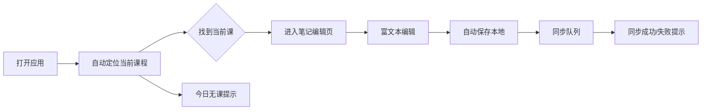
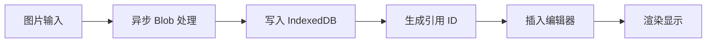
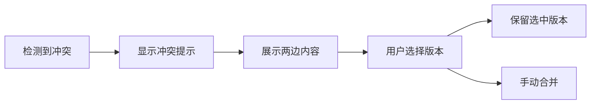

## 1. 产品概述

课堂笔记应用是一款面向学生和教师的纯前端笔记工具，解决学生上课跟不上老师讲得快、笔记丢三落四的痛点。应用基于 Solid.js 构建，数据存储在浏览器本地（localStorage + IndexedDB），支持多端同步，提供富文本编辑、数学公式渲染、图片附件管理等核心功能。

- **目标用户**：中学生、大学生、教师
- **核心价值**：高效记录课堂内容，支持数学公式和代码高亮，多设备同步，方便复习和分享

## 2. 核心功能

### 2.1 用户角色

| 角色 | 登录方式 | 核心权限 |
|------|----------|----------|
| 学生 | 本地账号/模拟登录 | 创建编辑笔记、分享笔记、搜索笔记 |
| 教师 | 本地账号/模拟登录 | 查看班级学生笔记、添加批注、管理班级 |

### 2.2 功能模块

1. **首页/课程选择**：课程表展示、当前课程自动定位、今日无课提示
2. **笔记管理**：按课程组织、课堂实录/课前预习双分支、笔记列表
3. **富文本编辑器**：加粗/斜体/标题/列表/引用/行内代码
4. **数学公式**：KaTeX 渲染、行内$公式$、块级$$公式$$
5. **代码高亮**：多语言代码块语法高亮
6. **图片管理**：拍照上传、剪贴板粘贴、拖拽上传、IndexedDB 存储
7. **多端同步**：实时同步、冲突处理、离线标记、同步队列
8. **笔记分享**：只读链接、可编辑副本、分享管理
9. **教师批注**：批注添加、双向引用、折叠显示
10. **搜索功能**：标签搜索、日期搜索、全文搜索、公式搜索
11. **手写画板**：平板手写支持、撤销/重做 50 步历史
12. **导入导出**：Markdown/HTML/PDF 导出、Markdown/Word 导入

### 2.3 页面详情

| 页面名称 | 模块名称 | 功能描述 |
|-----------|-------------|---------------------|
| 首页 | 课程表卡片 | 展示本周课程表、自动高亮当前节次、点击进入对应课程笔记 |
| 首页 | 快速入口 | 搜索入口、新建笔记、今日课程快捷入口 |
| 笔记列表页 | 侧边栏 | 课程列表、课堂实录/课前预习切换 |
| 笔记列表页 | 笔记列表 | 笔记卡片、标签显示、搜索过滤 |
| 笔记编辑页 | 富文本编辑器 | 工具栏、编辑区域、实时预览 |
| 笔记编辑页 | 图片上传 | 拍照/粘贴/拖拽三种上传方式 |
| 笔记编辑页 | 手写画板 | Canvas 画板、画笔工具、撤销重做 |
| 笔记编辑页 | 同步状态 | 未同步标记、同步进度、冲突提示 |
| 搜索页 | 搜索框 | 关键词输入、标签筛选、日期筛选 |
| 搜索页 | 结果列表 | 按相关度排序、高亮命中关键词 |
| 分享页 | 分享链接 | 生成只读/可编辑链接、链接管理 |
| 批注面板 | 批注列表 | 教师批注、折叠展开、回复批注 |

## 3. 核心流程

### 3.1 记笔记流程

学生打开应用 → 系统自动定位当前课程 → 进入课堂实录笔记 → 富文本编辑（文字/公式/图片/代码）→ 自动保存本地 → 同步到云端 → 查看同步状态

### 3.2 图片上传流程

选择图片（拍照/粘贴/拖拽）→ 异步写入 IndexedDB → 生成引用 ID → 插入笔记 → 显示图片

### 3.3 同步冲突流程

检测冲突 → 提示用户 → 展示两边内容 → 用户选择保留版本 → 合并/覆盖

## 4. 用户界面设计

### 4.1 设计风格

- **主色调**：深蓝（#1e3a5f 深靛蓝作为主色，代表学术感、稳重可靠
- **辅助色**：琥珀色（#f59e0b）作为强调色，用于高亮和重点标记
- **中性色**：暖灰色系，提供舒适的阅读体验
- **设计风格**：简洁学术风，干净利落，注重内容为王
- **按钮风格**：圆角 8px，轻微阴影柔和过渡
- **字体**：思源宋体作为标题字体，Inter 作为正文字体，等宽字体用于代码
- **布局风格**：三栏布局（侧边栏 + 笔记列表 + 编辑区）
- **图标风格**：线性图标，简洁清晰

### 4.2 页面设计概览

| 页面名称 | 模块名称 | UI 元素 |
|-----------|-------------|-------------|
| 首页 | 课程表 | 卡片式布局、当前课程高亮、星期切换 |
| 笔记编辑页 | 编辑器 | 固定工具栏、可编辑区域、实时预览、公式预览 |
| 笔记编辑页 | 侧边栏 | 课程树、笔记列表、标签筛选 |
| 搜索页 | 搜索结果 | 列表式、关键词高亮、相关度排序 |

### 4.3 响应式设计

- **桌面端**：三栏布局，侧边栏 250px + 列表 280px + 编辑区自适应
- **平板端**：两栏布局，侧边栏可收起
- **移动端**：单栏布局，底部导航
- **触摸优化**：按钮最小 44px 触摸区域，支持手势操作

### 4.4 动画与交互

- 页面切换：淡入淡出过渡
- 编辑器工具栏：悬停显示详细功能
- 同步状态：顶部小角标实时更新
- 公式渲染：输入时即时预览
- 图片上传：进度条 + 缩略图预览
