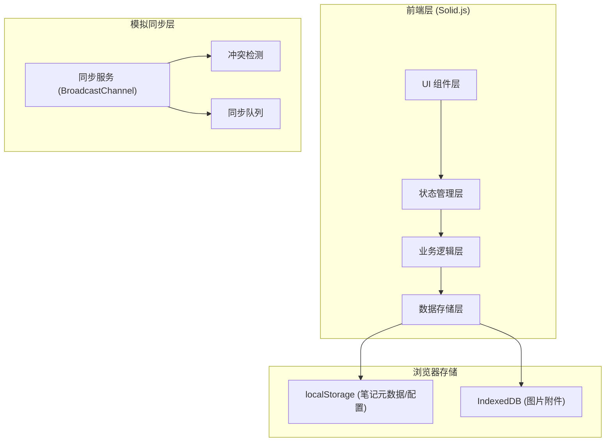
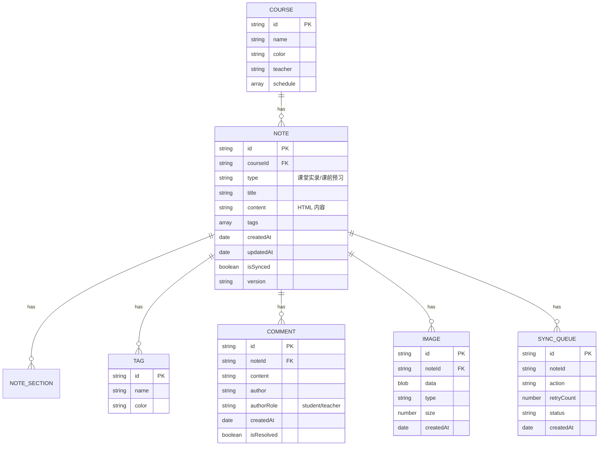

## 1. 架构设计



## 2. 技术描述

- **前端框架**：Solid.js 1.8 + TypeScript
- **构建工具**：Vite 5
- **样式方案**：TailwindCSS 3
- **状态管理**：Solid.js 内置信号 + createStore
- **路由**：@solidjs/router
- **富文本编辑**：基于 contenteditable 自定义实现
- **数学公式**：KaTeX 0.16
- **代码高亮**：highlight.js
- **图片存储**：IndexedDB (idb 库封装)
- **多端同步**：BroadcastChannel API + localStorage 事件模拟
- **导出**：html2canvas + jsPDF (PDF导出)
- **Word 导入**：mammoth.js
- **手写画板**：Canvas API + 自定义撤销重做栈

## 3. 路由定义

| 路由 | 用途 |
|-------|---------|
| / | 首页 - 课程表展示 |
| /course/:courseId | 课程笔记列表 |
| /course/:courseId/notes/:noteId | 笔记编辑页 |
| /search | 搜索页面 |
| /share/:shareId | 分享笔记查看 |
| /settings | 设置页面 |

## 4. 数据模型

### 4.1 数据模型定义



### 4.2 课程表示例数据

**课程表数据结构：
- 周一：语文、数学、英语、物理
- 周二：数学、化学、生物、历史
- 周三：英语、语文、数学、体育
- 周四：物理、化学、生物、地理
- 周五：数学、英语、语文、班会

每节课 45 分钟，上午 4 节，下午 4 节。

## 5. 核心模块设计

### 5.1 富文本编辑器模块

- 基于 contenteditable 实现
- 工具栏：加粗、斜体、标题（H1-H3）、有序/无序列表、引用、行内代码、代码块
- 公式：实时识别 $...$ 和 $$...$$
- 图片：通过引用 ID 插入，异步加载

### 5.2 图片管理模块

- 三种上传方式：拍照（getUserMedia）、粘贴（paste事件）、拖拽（drag事件）
- Blob 异步写入 IndexedDB，不阻塞 UI
- 笔记中仅存储引用 ID，不内联 base64
- 支持批量上传，进度显示

### 5.3 同步模块

- BroadcastChannel 实现多标签页/多设备模拟同步
- 离线时内容标记"未同步"
- 同步队列，失败重试最多 3 次，标红提示
- 冲突检测：基于版本号和时间戳
- 冲突处理：弹窗提示用户选择保留版本

### 5.4 搜索模块

- 全文搜索：笔记内容 HTML 转纯文本后搜索
- 公式搜索：提取 LaTeX 字符串参与搜索
- 标签搜索：按标签过滤
- 日期搜索：按日期范围过滤
- 相关度排序：按命中次数排序

### 5.5 手写画板模块

- Canvas 2D 实现
- 支持压感（如果设备支持）
- 撤销/重做栈，最多 50 步
- 画笔颜色、粗细调节
- 橡皮擦、清空功能

## 6. 项目结构

```
src/
├── components/          # 组件
│   ├── editor/         # 编辑器相关组件
│   ├── sidebar/        # 侧边栏组件
│   ├── course/         # 课程相关组件
│   ├── note/           # 笔记相关组件
│   ├── search/         # 搜索组件
│   ├── canvas/         # 画板组件
│   └── common/         # 通用组件
├── stores/             # 状态管理
│   ├── noteStore.ts
│   ├── courseStore.ts
│   ├── syncStore.ts
│   └── uiStore.ts
├── utils/              # 工具函数
│   ├── storage/          # 存储相关
│   │   ├── localStorage.ts
│   │   └── indexedDB.ts
│   ├── editor/         # 编辑器相关
│   │   ├── richText.ts
│   │   ├── katex.ts
│   │   └── codeHighlight.ts
│   ├── sync/           # 同步相关
│   │   ├── syncService.ts
│   │   └── conflictResolver.ts
│   ├── export/         # 导入导出
│   │   ├── exportNote.ts
│   │   └── importNote.ts
│   └── search.ts
├── types/              # 类型定义
│   └── index.ts
├── pages/              # 页面
│   ├── Home.tsx
│   ├── CourseList.tsx
│   ├── NoteEditor.tsx
│   ├── Search.tsx
│   ├── ShareView.tsx
│   └── Settings.tsx
├── App.tsx
├── main.tsx
└── index.css
```
